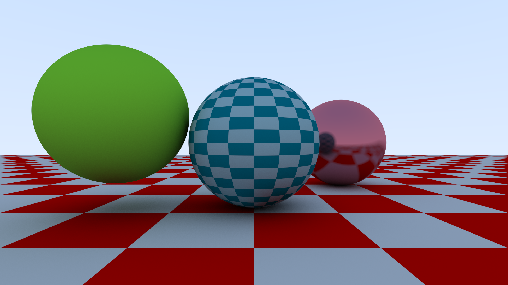
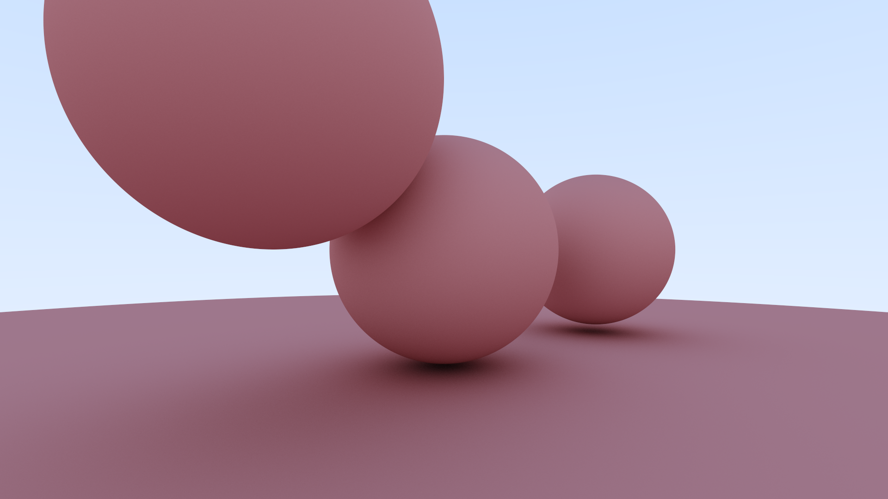

# optica
A C++ path tracer and scene describer, built from scratch with zero dependencies.

### Requirements
- `g++` version 8 or higher

### Building and Running
- Create your scene in `main.cpp`. You can also leave it as is to render the demo scene.
- In the project root, run `make` to build the binary.
- Run the built binary with `./optica`.
    - The image will be saved in the `out/` directory.

### Screenshots

More features coming soon...
